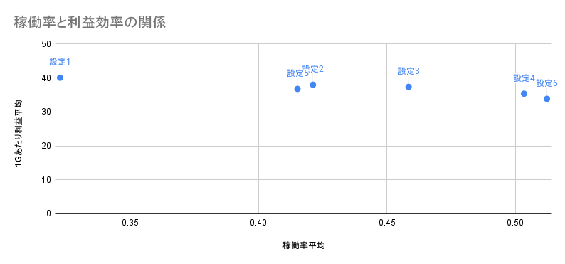

# スロット（ジャグラー）設定分析ポートフォリオ

## ■ 背景・目的
スロット店舗運営においては、利益の最大化と同時に
継続的な集客（稼働）の維持が重要である。

しかし、高設定を増やすと利益は低下し、
低設定を増やすと稼働が低下するというトレードオフが存在する。

本分析では、このトレードオフを定量的に可視化し、
最適な設定配分を導くことを目的とする。

このトレードオフ構造は、広告予算や商品ラインナップの
配分最適化と同じ問題であり、
データに基づく意思決定が求められるあらゆる場面に応用できる。

## ■ データ概要
・4店舗 × 各10台  
・10日間  
・台 × 日単位

## ■ 指標定義
・投入枚数 = 回転数 × 3  
・利益 = (投入 - 払出) × 20円  

## ■ 分析内容
・設定推定  
・設定別の稼働率・利益分析  
・散布図による関係性の可視化  

## ■ 分析結果
## ■ 分析結果
高設定は稼働を向上させる一方、利益効率が低い傾向が確認された。
低設定は利益効率が高いが、稼働が低い傾向が見られた。
これらの結果から、稼働率と利益効率にはトレードオフの関係があることが示唆された。

## ■ 考察
特に設定4と5はスペック差が小さく、短期データでは判別が難しいため、
推定精度の影響を受けやすい点も要因の一つと考えられる。 

## ■ 結論
設定4〜5がバランス良いが、
設定5は不安定なため優先度を下げた。

そのため、以下の配分を最適とした：

・設定6：2台  
・設定4：5台  
・設定1：3台  

この配分により稼働率45.0%・推定利益約169万円を想定。
全台低設定比較で利益は約27%向上し、
全台高設定比較で稼働率は約12%低下するが、
利益とのバランスを考慮すると最適な配分と考えられる。

単純な高設定依存ではなく、中間設定を軸とした運用が
収益最大化に寄与することが示唆された。

## ■ 今後の改善
・データ期間の拡張  
・設定推定精度の向上  
・小役を含めた利益計算

## ■ 可視化
### 設定別の稼働率と利益効率の関係

設定ごとの平均値をプロットした結果、
稼働率と利益効率の間に明確なトレードオフが確認された。

※分析に使用したデータおよび計算過程はこちら   
（https://docs.google.com/spreadsheets/d/1i25K-KmSeRso_6VpVCPcWTihd73xr2IbcWed3ngXfis/edit?usp=sharing）
