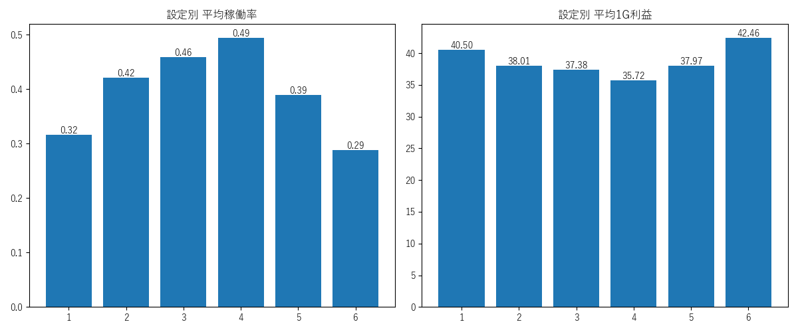
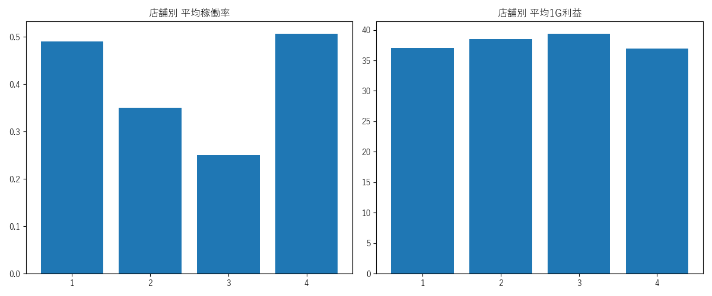
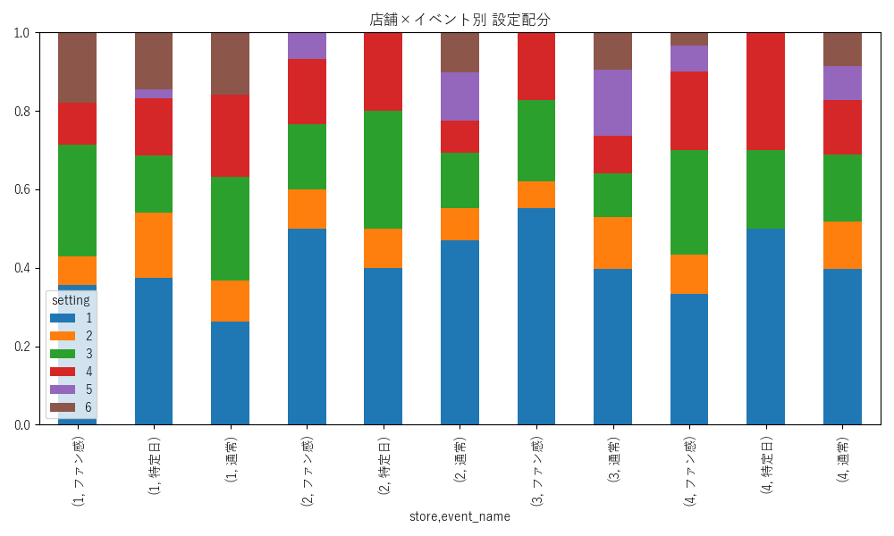
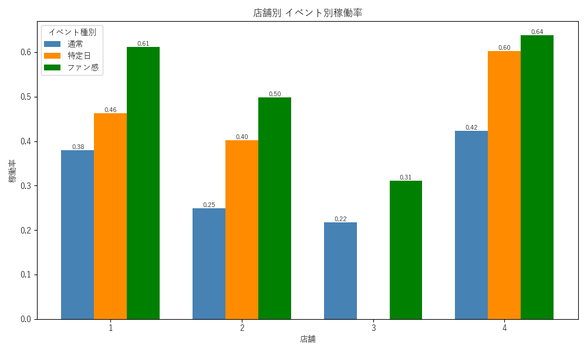
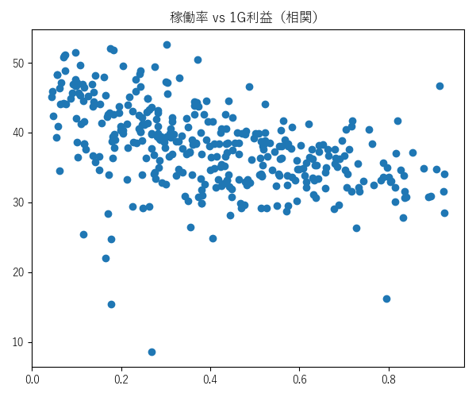
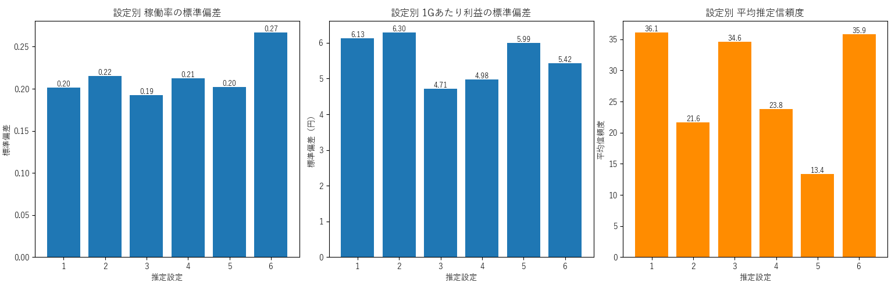

# スロット（ジャグラー）設定分析ポートフォリオ

## ■ 使用技術・環境
- Python 3.14
- pandas / matplotlib / numpy
- データ：シミュレーション生成データ（実店舗データをもとに構造を再現）

---

## ■ 背景・目的
スロット店舗運営においては、
**利益の最大化と集客（稼働）の維持**の両立が求められる。

しかし実際には、

- 高設定を増やす → 稼働は上がるが利益は低下
- 低設定を増やす → 利益は上がるが稼働は低下

という明確なトレードオフが存在する。

本分析ではこの構造を定量的に可視化し、
**戦略別に最適な設定配分を導くこと**を目的とする。

---

## ■ データ概要
- 4店舗 × 各10台
- 10日間
- 台 × 日単位のシミュレーションデータ

---

## ■ 指標定義
- 投入枚数 = 回転数 × 3
- 利益 = (投入 - 払出) × 20円
- 1Gあたり利益 = 利益 ÷ 回転数
- 稼働率 = 実稼働 / 最大稼働

※BB・RB両方0の行およびデータ異常フラグの行は分析から除外

---

## ■ 設定の分類
| 分類 | 設定 |
|------|------|
| 低設定 | 設定1・2・3 |
| 高設定 | 設定4・5・6 |

---

## ■ 分析内容

### ① 設定別分析
設定ごとの稼働率・1Gあたり利益・1日利益を算出

### ② 店舗別分析
店舗ごとの稼働率・利益効率を比較

### ③ イベント分析
店舗×イベントごとの設定配分と稼働変化を可視化

### ④ 相関分析
稼働率と利益効率の相関を分析し、トレードオフ構造を定量化

### ⑤ イベント効果分析
通常営業との比較で稼働・利益の増減を算出

### ⑥ 分散分析 + 推定信頼度
設定ごとの標準偏差と平均推定信頼度を可視化し、
データの安定性と推定精度の限界を明示

### ⑦ 最適配分シミュレーション
以下の実務的制約を設けたうえで全探索により最適化：
- 設定6は最大3台まで
- 設定の種類は最低3種類以上
- 低設定（1〜3）は最低2台以上

5パターンで結果を比較：
- 利益最大 / 稼働最大 / バランス / 稼働重視 / イベント

---

## ■ 分析結果

### トレードオフの存在
稼働率と利益効率には負の相関が確認され、両立が難しい構造が明確になった。

### 設定別の特徴
- **設定6**：高稼働だが利益効率が低い（広告的役割）
- **設定4**：稼働・利益ともに安定
- **設定5**：今回の分析ではばらつきが大きく出た

### 設定5の特徴
今回の分析では設定5の結果にばらつきが見られたが、
これはサンプル数の不足による統計的ブレが主因と考えられる。

### 推定信頼度の構造
設定別の平均推定信頼度を分析した結果、
**高設定ほど推定信頼度が低い傾向**が確認された。

低設定は設定差分が収束しやすく推定精度が高い一方、
高設定は差分のブレが大きく推定が難しいという
実務的にも納得感のある構造が定量的に示された。

### イベント効果
イベント時は稼働が上昇・利益が低下し、集客と利益のトレードオフが明確に確認された。

---

## ■ 考察

### 設定は「期待値×分散」で評価すべき
平均値だけでなく分散（リスク）も考慮することで、より実務的な意思決定が可能となる。

### 設定5の位置づけ
設定5（機械割約103〜105%）は設定4と同様に高設定に分類されるが、
今回の分析では結果のばらつきが大きく出た。

これはサンプル数の不足による統計的ブレが主因と考えられ、
設定5の性質そのものを反映しているとは言い切れない。

データ期間を拡張し、設定5のサンプルを増やすことで
より信頼性の高い評価が可能になると考える。

### RB確率による高設定演出
RB確率を上げることで高設定の印象を与えつつ、
設定4を中心とした安定運用でリスクをコントロールする戦略が有効と考えられる。

### データの限界について
本分析はシミュレーションデータを使用しており、
かつ高設定ほど推定信頼度が低いという構造的な制約がある。

そのため高設定（特に設定5・6）の分析結果は参考値として扱い、
実データの蓄積と設定推定精度の向上が今後の課題である。

---

## ■ 結論

実務的制約を加えたうえで戦略別の最適配分を提示：

| 戦略 | 中心設定 |
|------|----------|
| 安定運用 | 設定4 |
| 集客重視 | 設定6（最大3台） |
| イベント時 | 設定5（サンプル拡張後に要再評価） |

本分析では、単一の最適解ではなく、**複数の戦略別最適解を提示**した点が特徴である。
また推定信頼度の可視化により、**データの限界を定量的に示した**点も特徴とする。

---

## ■ 可視化

### 設定別分析

### 店舗別分析

### 設定配分（イベント）

### イベント別稼働

### 相関分析

### 分散分析 + 推定信頼度

---

## ■ 今後の改善
- データ期間の拡張（特に設定5のサンプル数確保）
- 設定推定精度の向上
- 小役データを含めた分析
- 店舗別戦略の最適化

---

## ■ データ
https://docs.google.com/spreadsheets/d/1i25K-KmSeRso_6VpVCPcWTihd73xr2IbcWed3ngXfis/edit?usp=sharing